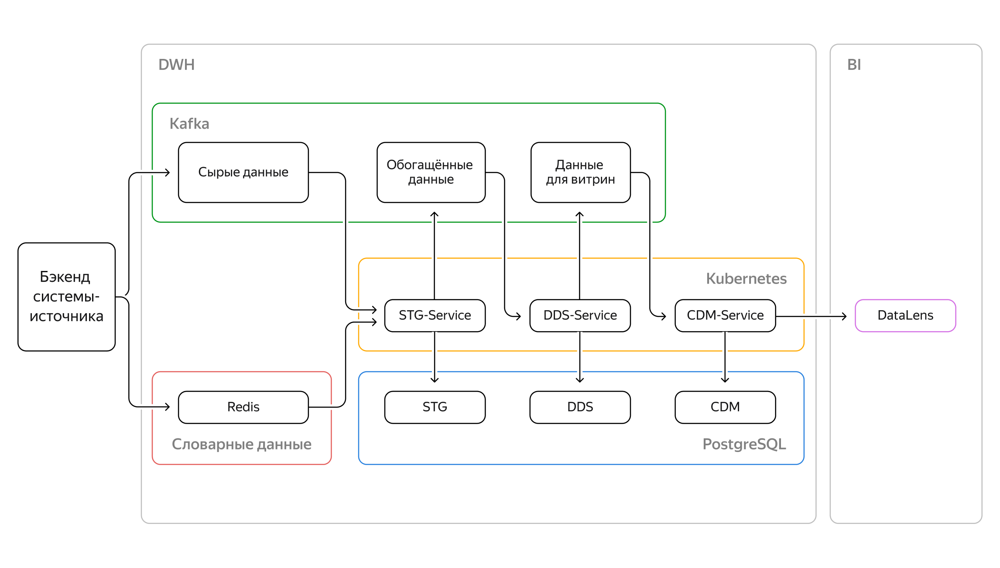

# **Создание DWH с использованием облачных технологий для агрегатора доставки еды**

## **Задачи проекта**
1. С помощью Kubernetes написать сервис для наполнения слоя с сырыми данными.
2. С помощью Kubernetes написать сервис для наполнения слоя DDS.
3. С помощью Kubernetes написать сервис для наполнения слоя с витринами.

## **Используемые инструменты**

- **`Yandex Cloud`**
- **`Kubernetes`**
- **`Redis`**
- **`PostgreSQL`**
- **`Docker`**
- **`Python`**
- **`Kafka`**

## **Структура репозитория**

- `/solution/service_stg` - микросервис для создания, заполнения stg-слоя DWH и отправки данных в топик для service_dds.
- `/solution/service_dds` - микросервис для создания, заполнения dds-слоя, обработки данных и отправки данных в топик для service_cdm.
- `/solution/service_cdm` - микросервис для создания и заполнения нужных витрин.

## **Архитектура решения**

